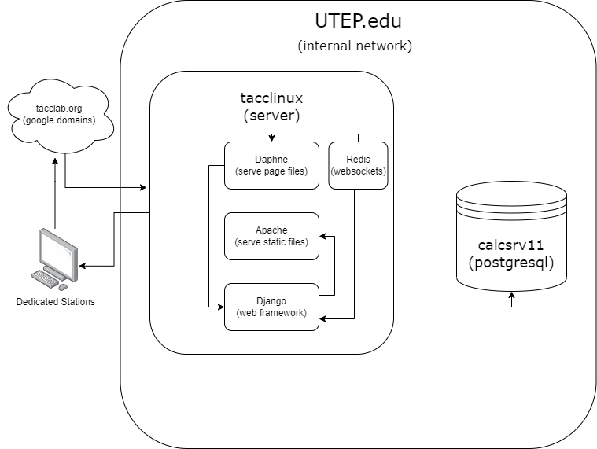

# COBA Employee Check-in/out System

## Introduction
This is a simple employee check-in/out system. It is a web application that allows employees to check-in and check-out. It also allows admin to view the check-in/out history of all employees.

## Features
- Employee check-in/out
- Admin view check-in/out history of all employees
- Automatic check-out after 6:40pm of the day
- Weekly report of employee check-in/out emailed to admin
- Flexible API for integration with other systems

## Installation
1. Clone this repository
2. Install python3 and pip3
3. Install virtualenv
4. Create a virtual environment
5. Activate the virtual environment
6. Install the requirements
7. Run the server

### Full deployment guide
- To properly deploy this application, please refer to the [deployment guide](ubuntu-deployment-guide.md).

## Simplified architecture

